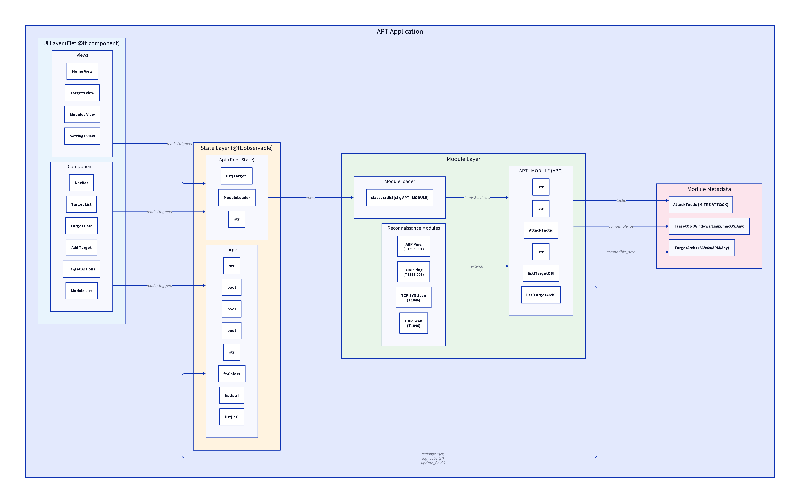

# APT

## Augmented Penetration Testing

### What is APT?

APT is a toolkit built for easily incorporating custom pythong scripts into a repeatable and auditable environment.

### Why not just add modules to metasploit or some other toolkit?

A lot of tools and random POC exploits are just python scripts. Metasploit modules need to be written in ruby which not a lot of people use anymore.

### APT Architecture

